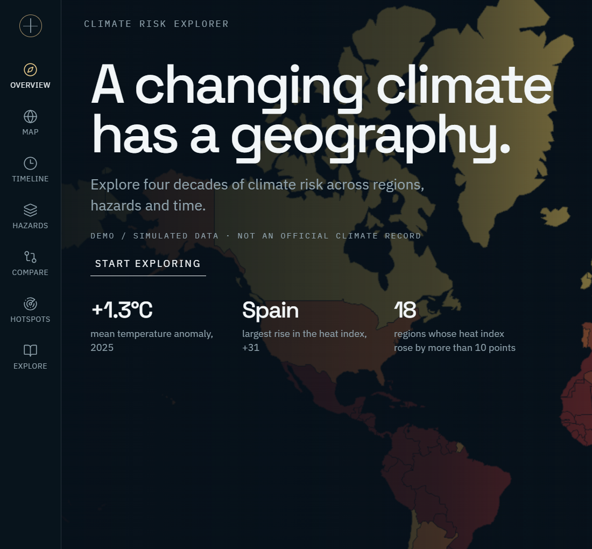
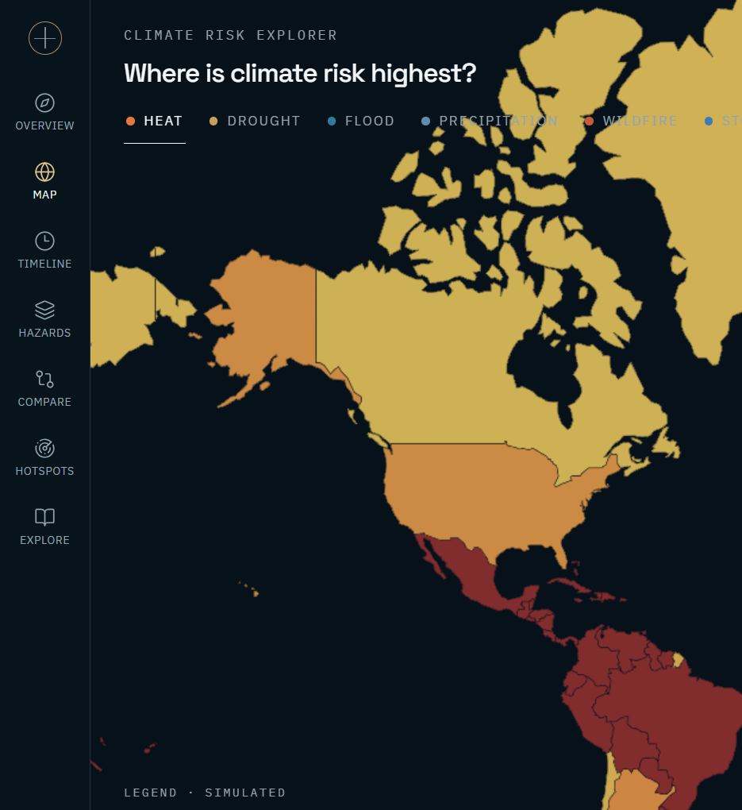

# Climate Risk Explorer

Interactive visual analytics for climate risk. The map is the canvas. Time, hazard, and historical baseline stay in one shared state, so a selection such as Spain, extreme heat, and 2005–2025 follows the user from the globe into a trend, a comparison, and an investigation.

> Explore how climate risks evolve across regions, through time, and across different climate hazards.

**Temperature is observed. The other hazards are simulated.** Monthly country temperature is ERA5 2 m temperature, aggregated by [Our World in Data](https://ourworldindata.org/grapher/average-monthly-surface-temperature) (contains modified Copernicus Climate Change Service information, 2026). The app uses complete years from 1980 through 2025. Heat days, drought, precipitation, flood, wildfire and storm remain a seeded simulation (seed 42) and are labeled as such. They are not derived from the observed temperature.

## Overview

The application answers one question: how climate risk changes across space and time. Exploration is progressive:

`GLOBAL → REGION → HAZARD → TREND → ANOMALY → EVENT`

A world map colored by the selected hazard sits behind every view. A timeline plays the geography forward from 1980 to 2025. Selecting a country opens a climate fingerprint, a layered trend, climate stripes, and a narrative investigation. Up to four territories can be compared on identical scales.

## Demo





A complete path, without a page reload:

1. Land on the map. The title sits on the geography.
2. Choose **Extreme Heat** and press play. Country colors shift year by year.
3. Select **Spain**. The camera moves in, other countries fade, and the profile panel opens.
4. Read the fingerprint, the heat-day trend against the 1980–2000 baseline, and the climate stripes.
5. Open **Compare**, add France, and watch both trajectories on one scale.
6. Open **Hotspots**, or choose **Investigate** for the long-term trend, seasonality, baseline, extreme years, and the related drought series.

Share a view with the URL, for example:

`/explore?region=ESP&hazard=heat&year=2025&start=2005&end=2025&b0=1980&b1=2000`

## Why this project

Recruiters should be able to see, in about thirty seconds, that this is an analytical product rather than a dashboard of cards:

1. It analyzes change in climate risk across regions, hazards, and four decades.
2. It solves a real stack of problems: a reproducible data pipeline, documented indicators, a typed API, coordinated map and chart state, and uncertainty that stays visible.
3. The visualizations are interactive. The playhead, the hazard, and the selected territory drive the same numbers everywhere.
4. The interface is a scientific atlas: one dominant question per view, numbers treated as typography, and color reserved for data.

## Analytical Questions

| View | Question |
| --- | --- |
| Map | Where is climate risk highest? |
| Timeline | How has the spatial pattern changed? |
| Hazards | What does this hazard look like on its own scale? |
| Profile | What risks define this territory? |
| Trend | How has this hazard evolved? |
| Anomaly | Is the recent value unusual against the baseline? |
| Compare | How do these regions differ? |
| Hotspots | Where are unusual patterns emerging? |
| Investigation | What pattern is in the series we just selected? |

## Features

- MapLibre world map with no basemap tiles: dark ocean, country fills, hatch for missing data, graticule, hover tooltip, and a camera move on selection.
- Six hazards — heat, drought, flood, extreme precipitation, wildfire, storm — each with its own color scale, legend, and metric.
- Timeline with drag, a range window, play/pause, and 1× / 2× / 4× speeds. Playback does not rebuild the map.
- Radial climate fingerprint (D3) that morphs when the region, year, or period changes.
- Layered trend: annual series, trailing 5-year mean, baseline, anomaly area, OLS trend, and a 95% band.
- Diverging anomaly mode, climate stripes, and a visual baseline comparison.
- Comparison of up to four regions: shared-scale fingerprints and trajectories, with cross-highlight.
- Hotspot ranking from risk, anomaly, positive trend, and concurrent hazards, drawn as markers on the map.
- Scrolly investigation: trend, seasonality, baseline, extreme years, related hazard. Statements are computed from the series.
- Shared Zustand state, URL encoding, keyboard year and playback controls, reduced motion, and explicit empty states (`NO DATA AVAILABLE`, never a silent zero).

## Architecture

```
Climate Data
        ↓
Python Processing
        ↓
Climate Indicators
        ↓
FastAPI
        ↓
React Application
        ↓
D3 + MapLibre
        ↓
Interactive Exploration
```

The annual series is computed once and served by `GET /api/bootstrap`. The browser derives map values, trends, anomalies, hotspots, and comparison series from that payload so scrubbing stays local. Monthly series stay on the server and are requested only for seasonality.

## Data Pipeline

```
RAW CLIMATE DATA
        ↓
Python ingestion          generate_climate_data.py
        ↓
Data validation           src/climate_pipeline/validation.py
        ↓
Cleaning                  missing years stay missing
        ↓
Spatial aggregation       Natural Earth 110m countries
        ↓
Temporal aggregation      monthly → annual
        ↓
Climate indicators        src/climate_pipeline/indicators.py
        ↓
Risk normalization        0–100 indices
        ↓
API / optimized files     data/processed/*.json
        ↓
Interactive frontend
```

| Path | Role |
| --- | --- |
| `data/geographic/ne_110m_admin_0_countries.json` | Natural Earth country boundaries |
| `data/raw/climate_monthly.csv` | Simulated monthly rows |
| `data/processed/climate.json` | Annual series for every country |
| `data/processed/monthly.json` | Monthly series used by seasonality |
| `frontend/public/geo/countries.json` | Slim GeoJSON (`iso`, `name`, `continent`) |

Boundaries use Natural Earth `ADM0_A3`. `ISO_A3` is `-99` for France and Norway, so the pipeline keys countries on `ADM0_A3`.

## Climate Indicators

Default baseline: **1980–2000**. A baseline needs at least 5 observations. A trend, correlation, or percentile needs at least 8. A trailing 5-year window with any gap is left empty.

| Indicator | Formula |
| --- | --- |
| Temperature anomaly | `temperature(year, region) − mean(region, baseline)` |
| Extreme heat days | Sum over months of `days × P(daily max > 30°C)`. Daily maxima are modeled as normal around the monthly mean plus a zone offset. February is 28 days. This is a proxy, not a station count. |
| Heat risk | `clip(100 × heat_days / 72, 0, 100)`. The cap is above a temperate summer so mid-latitude change stays visible. Tropical climates can still reach 100. |
| Precipitation anomaly | Annual precipitation − baseline mean, in mm. |
| Drought index | `clip(30 + 48 × ((1 − precip/climatology) × drought bias + 0.14 × temperature anomaly), 0, 100)`. Not SPEI. |
| Extreme precipitation | `clip(100 × (peak monthly ratio − 1) / 1.2, 0, 100)`. |
| Flood index | Exposure-weighted mix of annual precipitation and the wet-month peak, with a floor from coastal exposure. Exposure is a scenario factor. |
| Wildfire index | `fuel × (0.62 × summer drought + 0.38 × heat risk) × (0.55 + 0.45 × fuel)`. Fuel is a scenario factor, not an observed fuel map. |
| Storm index | Exposure level plus a small prescribed drift and noise. |
| Trend | OLS of the metric on year. The shaded band is the 95% confidence interval of the mean response. |
| Combined risk | `0.24 heat + 0.20 drought + 0.16 flood + 0.14 precipitation + 0.16 wildfire + 0.10 storm`. Any missing component makes the combined index missing. |

Insights use descriptive language only: increased, decreased, remained relatively stable, above baseline, below baseline. They do not claim a physical cause.

Hotspot score, weights summing to 1:

`0.35 × risk + 0.25 × anomaly + 0.25 × positive trend + 0.15 × concurrent hazards (index ≥ 65)`

Anomaly is scaled before scoring: heat in °C / 2.5, precipitation in mm / 250, other indices / 30. A trend reaches a full score at 0.06°C/year, 8 mm/year, or 0.8 index points/year.

## Data Sources

Geography is Natural Earth 110m.

Temperature comes from `data/raw/owid/average-monthly-surface-temperature.csv`. `src/climate_pipeline/observations.py` writes a country-year mean only when all twelve months are present. A country missing from that file stays null. It is not filled with the simulation or with zero.

`generate_climate_data.py` still builds the other hazards with seed 42 for 1980–2025, including France, Spain, Portugal, Germany, Italy, Morocco, the United Kingdom, Sweden, Norway, Poland, Greece, and the Netherlands. Mediterranean summer warming, drought bias, flood exposure, fuel, and storm exposure are simulator knobs. They are documented as such and are not observations.

Greenland drops every year divisible by 7 in the simulated hazard indices, so missing-data handling can be tested. Those hazard values stay null. Observed temperature is kept when the OWID file has it.

## Tech Stack

| Layer | Choice |
| --- | --- |
| Interface | React 18, TypeScript strict, Vite |
| Maps | MapLibre GL JS |
| Charts | D3 |
| Motion | Framer Motion, plus CSS transitions of 200–600 ms |
| Icons | Lucide |
| State | Zustand |
| API | Python, FastAPI |
| Numerics | NumPy |
| Tests | pytest, Vitest |

Styling is a small custom design system (IBM Plex Sans, Space Grotesk, IBM Plex Mono) so the product does not inherit a generic component-library look. Color encodes the hazard. Heat runs yellow → orange → red, drought sand → amber → brown, flood cyan → blue, precipitation light → deep blue, wildfire orange → red → dark red, storm cyan → violet.

## Project Structure

```
generate_climate_data.py
api/                         FastAPI app and ClimateStore
src/climate_pipeline/        schema, simulation, indicators, insights, validation
data/raw/owid/               ERA5 country temperature (Our World in Data)
data/raw/climate_monthly.csv simulated hazards plus observed temperature
data/processed/              annual and monthly JSON
data/geographic/             Natural Earth boundaries
frontend/src/
  components/Map/            ClimateMap, legend, tooltip
  components/Timeline/       timeline and playback
  components/RiskProfile/    climate fingerprint
  components/Trends/         trend, baseline comparison, stripes
  components/Investigation/  seasonality, extreme years
  components/Layout/         rail, header, detail panel, methodology
  pages/                     overview, map, timeline, hazards, compare, hotspots, explore
  store.ts                   shared exploration state
  analytics.ts               profiles, trends, hotspots, story steps
notebooks/                   indicator walkthrough
tests/                       Python indicator and API tests
docs/screenshots/
```

## Installation

Requires Python 3.11+ and Node 20+.

```powershell
python -m venv .venv
.\.venv\Scripts\python.exe -m pip install -r requirements.txt
.\.venv\Scripts\python.exe generate_climate_data.py

cd frontend
npm install
```

On macOS or Linux, use `.venv/bin/python` in place of `.\.venv\Scripts\python.exe`.

## Running Locally

The Vite dev server proxies `/api` to port **9001**.

```powershell
# terminal 1 — API
.\.venv\Scripts\python.exe -m uvicorn api.main:app --host 127.0.0.1 --port 9001

# terminal 2 — interface
cd frontend
npm run dev
```

Open [http://localhost:5173](http://localhost:5173). The API health check is [http://127.0.0.1:9001/api/health](http://127.0.0.1:9001/api/health).

Tests:

```powershell
.\.venv\Scripts\python.exe -m pytest
cd frontend
npm test
```

## API

| Endpoint | Purpose |
| --- | --- |
| `GET /api/health` | Process check. `data_origin` is `mixed`: observed temperature, simulated hazards. |
| `GET /api/meta` | Dataset origin, year span, region count. |
| `GET /api/bootstrap` | Regions plus annual series. This is what the interface loads. |
| `GET /api/regions` | Region list. |
| `GET /api/hazards` | Hazard definitions and scales. |
| `GET /api/methodology` | Formulas and assumptions. |
| `GET /api/risk/map` | Choropleth values for `hazard`, `year`, `mode`. |
| `GET /api/risk/{region}` | Profile for a period. |
| `GET /api/trends/{region}/{hazard}` | Annual series, rolling mean, baseline, trend band. |
| `GET /api/anomalies/{region}` | Value minus baseline. |
| `GET /api/seasonality/{region}/{hazard}` | Monthly shape. |
| `GET /api/events/{region}` | Simulated extreme years (high percentile and above the median). |
| `GET /api/hotspots` | Ranked regions for a year and hazard. |
| `GET /api/compare` | Up to four regions, `regions=FRA,ESP`. |
| `GET /api/investigation/{region}` | Narrative steps computed from the series. |

Shared parameters: `year`, `start_year`, `end_year`, `hazard`, `baseline_start`, `baseline_end`.

## Methodology

Temperature is the annual mean of ERA5 monthly country values from Our World in Data. Heat days are the expected number of days above 30°C under a normal daily-maximum model, not an observed count, and they are not computed from the ERA5 series. Drought is a precip-deficit and temperature-excess index centered near 30 on the 1980–2000 climatology. Flood, wildfire, and storm mix a climate signal with an exposure or fuel factor that does not vary from a satellite record.

The absolute map uses a fixed 0–100 scale, not a per-year percentile, so playback shows change instead of repainting every year to the same contrast. Anomaly mode uses a fixed diverging domain (°C for heat, millimetres for precipitation, index points otherwise).

Trend uncertainty is the OLS mean-response interval. Coverage is the share of years present. Estimated heat days are marked as a proxy in the methodology panel (`How is this calculated?`).

`notebooks/01_climate_indicators.ipynb` recomputes the Spain heat baseline, the anomaly, and the risk index from `data/processed/climate.json`.

## Data Limitations

- Temperature and its anomaly are ERA5 via Our World in Data. Cite them as such. Do not cite heat days, drought, precipitation, flood, wildfire or storm as observed climate.
- Extreme years in the investigation are simulated threshold crossings. They are not named historical disasters.
- The 30°C heat-day model saturates in hot climates, so the tropics often sit at the top of the heat scale. Mid-latitude change is what the scale is built to show.
- Drought is not SPEI, SPI, or a soil-moisture product.
- Fuel, flood exposure, and storm exposure are scenario knobs.
- Country polygons are Natural Earth 110m. Small territories and disputed boundaries are whatever that extract contains.
- Greenland has intentional gaps. A missing year is omitted from means, trends, and the map (hatched), and is never replaced with zero.
- Combined risk is undefined when any component is missing.
- The hotspot list is a single-year score. A region can lead the 2005–2025 heat story without topping the hotspot list in one paused year.

## Screenshots

The images above are the overview and the heat map at desktop width (1440×900). Both carry the simulated-data label. Capture further views from a running local session; the URL keeps the region, hazard, year, period, and baseline.

## Future Improvements

- Replace the simulated hazards with documented observations behind the same schema. Temperature is already ERA5 via Our World in Data.
- Add subnational regions where the source grid supports them.
- Serve vector tiles instead of a single GeoJSON extract for denser boundaries.
- Persist comparison sets and investigation steps as shareable notebooks exported from the current URL.
- Calibrate the heat-day proxy against a published station or reanalysis count before any non-demo use.
